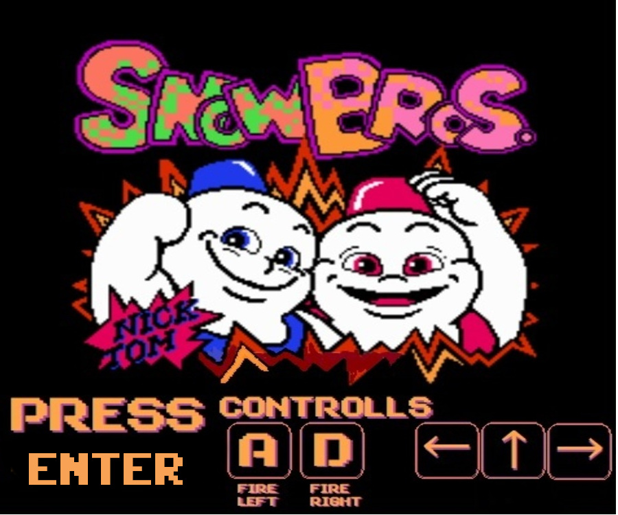
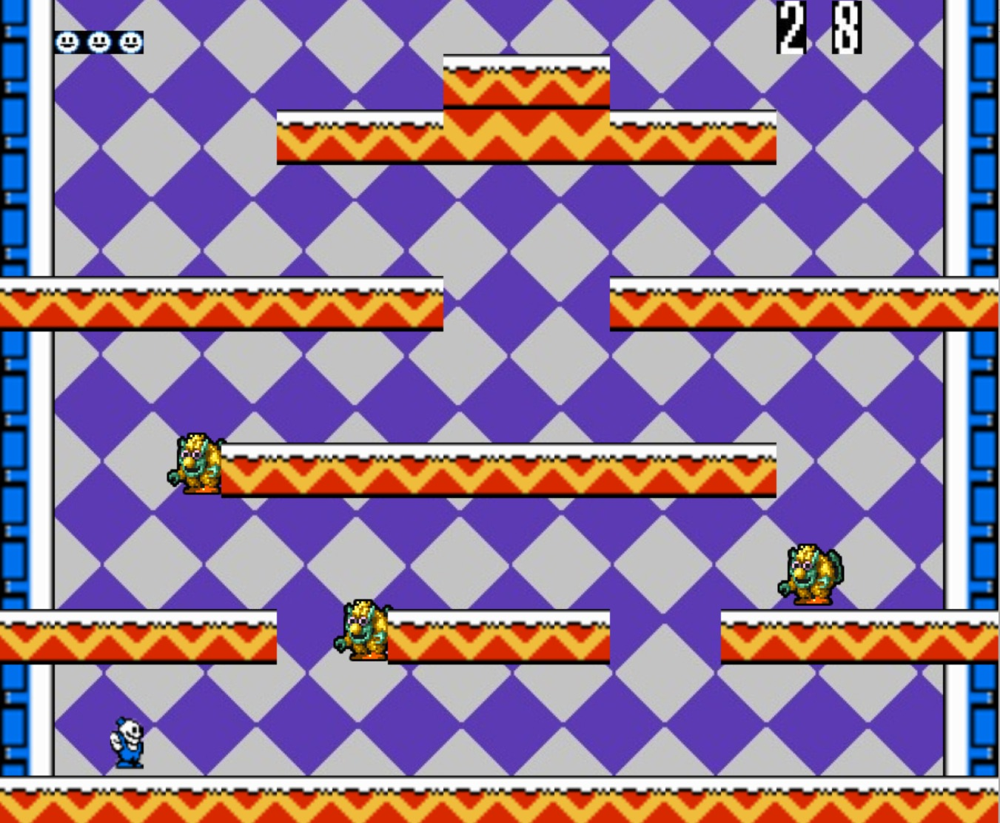
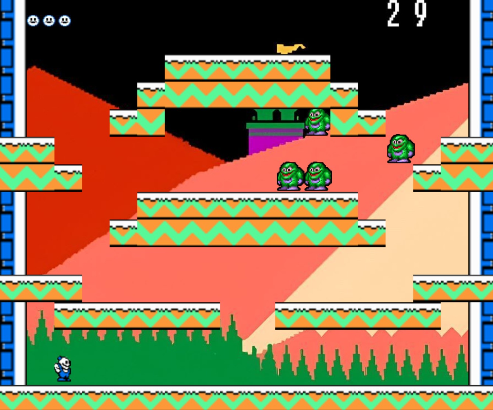
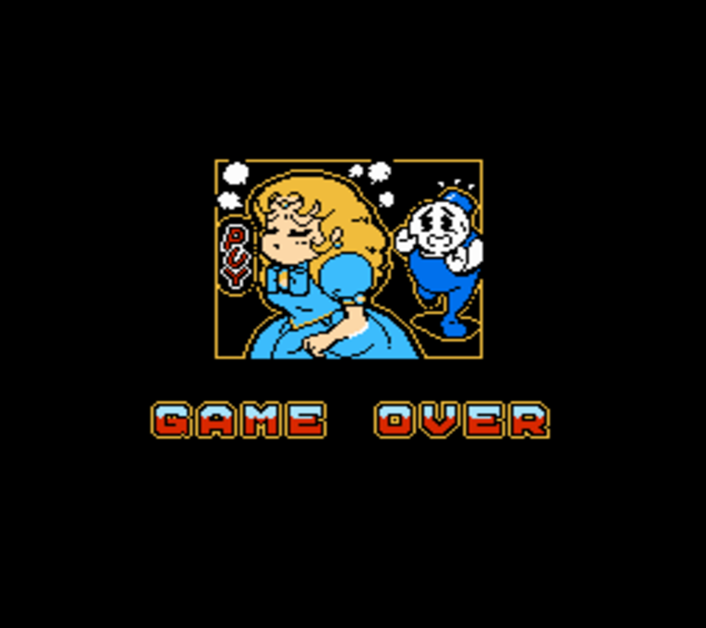

# Nombre del juego SnowBros

## Equipo de desarrollo

- Albici, Belen
- Chavez, Facundo
- Di Biase, Leonardo
- Fisz, Gustavo
- Gutierrez, Magali

## Capturas 

## Pantalla de Inicio

## Partida Ejemplo Nivel 1

## Partida Ejemplo Nivel 2

## Partida ganada

## Game Over

## Reglas de Juego / Instrucciones
Eliminar a todos los enemigos de ambos mapas para rescatar a la princesa

## Controles
- Comenzar partida: Enter
- Mover Cabezal: Flechas direccionales
- Disparar Poder hacia la derecha: D
- Disparar Poder hacia la izquierda: A